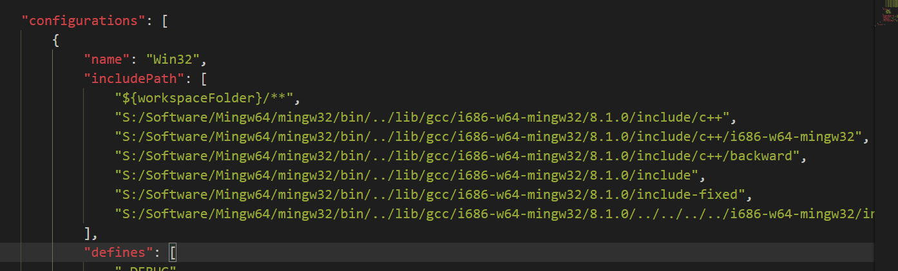

# VS_Code内置Git的使用
1. Git的命令使用：
    - 在VS_Code中使用组合键 "ctrl + `" 即可在下方调出win命令窗口（终端），这这个窗口里面正常使用Git命令即可
    - VSCode终端命令刚开始时不能运行，CMD中可以运行；这时以管理员身份运行VSCode一次即可解决这个问题

# VS_Code搭建C/C++编译器
1. [参考链接](https://www.jianshu.com/p/a0ae073e973b?utm_campaign=maleskine&utm_content=note&utm_medium=seo_notes&utm_source=recommendation)

2. [Vscode官网参考链接](https://code.visualstudio.com/docs/languages/cpp)

3. 需要的插件：
    - “C/C++”，该插件提供C/C++语言支持，简单的编辑，编译，调试等功能
    - “Code Runner”，该插件用来执行代码，快捷键（ctrl+alt+n）
    - “Run In Terminal”，程序的输出，运行是在内嵌的Terminal中，而不是在OUTPUT窗口中，可以进行输入操作

4. 额外的工具：MinGW-W64，注意不是MinGw，这个已经停止维护了，有很多坑 ，安装MinGW-W，并添加系统环境变量path

5. 添加配置文件:
    - take.json，用来build项目；打开命令面板(ctrl+shift+p)，输入tasks，选择Tasks:Configure Task，配置task.json，可参照vscode官网来写配置文件
    - launch.json，用来debug代码；最左边的一栏有个调式按钮(小虫子)，进入调式窗口，点击设置按钮，添加launch.json配置文件，详细配置可参照vscode官
    网

# python开发环境搭建


# Vs_Code使用
1. 更改主题快捷键：首先ctrl+k, 然后ctrl+t
2. 函数跳转：F12，跳转回来：ctrl+"-"
3. C/C++头文件不能打开的问题：
    - [参考](https://blog.csdn.net/qq_33202928/article/details/85099892)
    - vscode安装完成，MinGW安装完成并设置好环境变量，编写C程序时，提示说打不开标准头文件
    - 这种情况需要设置头文件的导入路径，在.vscode文件夹下添加c_cpp_properties.json文件（或点击旁边的提示），并设置includePath属性
    - includePath属性的获得：cmd下执行命令 "gcc -v -E -x c++ -"
    - 将得到的include路径填入includePath配置即可
    
4. 上下左右快捷键的设置
```
    {
        "key":"alt+j",
        "command":"cursorDown"
    }
```
5. 终端的使用
```
    1. VScode的终端（terminal）非常方便，可以使用Windows终端的的所有命令
        - git-bash：Windows安装git_bash后，可以在terminal中直接使用git命令
        - ssh：Windows安装ssh（Mobaxterm或其他）后，可以在terminal使用ssh命令连接服务器
```
6. 插件的使用
```
    1. SSH FS插件，安装后设置好参数，即可连接服务器，将其文件系统作为一个文件夹，显示在文件栏中
        - 前提：需要先在Windows上（host）安装好SSH软件（如，Mobaxterm），该插件会调用ssh软件
        - 使用：结合terminal，使用ssh命令连接Server，可以在Server中运行，调试程序
```


