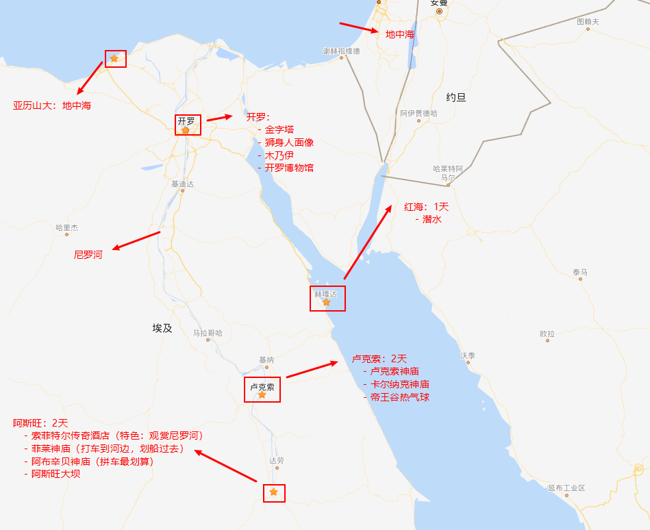
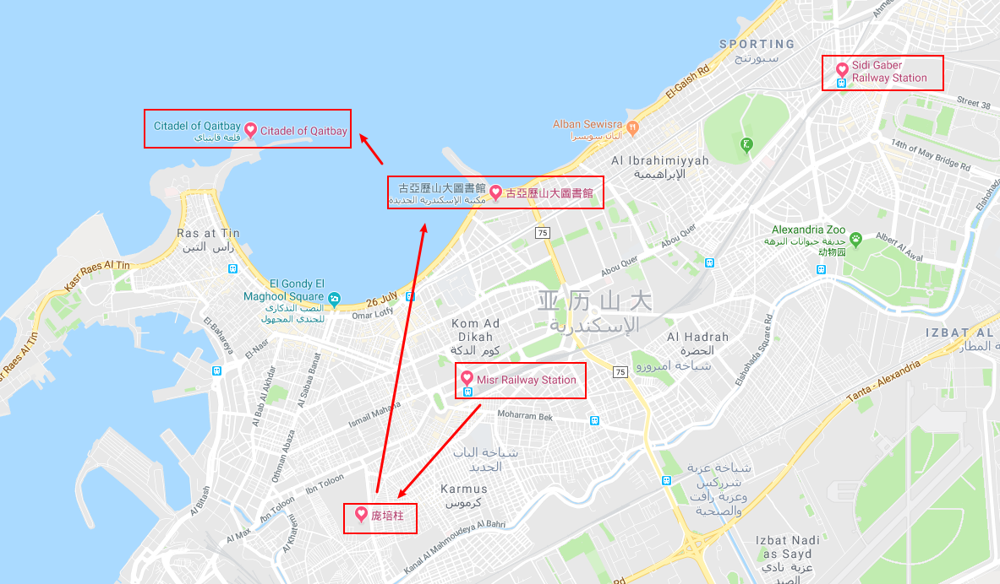

# 埃及旅行要准备的常用生活物品
1. 防晒和药品
2. 公牛转换插头
3. 移动电源
4. 洗漱用品
5. 防晒：墨镜、防晒霜、防晒服

# 埃及签证要准备的文件，办理的事物（落地签：visa on arrival）
1. **往返机票**的购买，并打印**登记牌**（有的航空公司不提供机场免费打印登机牌，需要一定费用，但在航班起飞前48小时内可免费打印）
2. 打印**机票行程单**，入境时需要检查
3. Booking 3星以上的酒店（如果不需要酒店，可以先预定，打印出**酒店行程单**，之后再取消）
4. 银行购汇2000美金并提现，提现需要提前打电话预定（购汇可以在手机银行app上自助购买，银行营业厅的电话可以在手机银行app中查到）
5. 国际学生证的办理，景点门票半价（微信公众号可以申请，买卡，激活）
6. 护照，注意检查有效期
7. 支付宝出境旅游险，以防万一
8. 境外流量包（如果手机卡支持，可以在手机营业点客户端查看）或境外手机卡（注意时差）
9. 所有航班，显示的起飞时间都是【起飞当地时间】，到达时间都是【到达地的当地时间】
10. 办理登记牌，因为乌克兰国际航空公司的不提供机场的登机牌打印服务，所以要下载对应的app办理登机服务，或在乌克兰航空官网上办理登机服务

# 飞机起飞后的注意事项
1. 填写入境卡：飞机上会发派一个入境卡，需要在进埃及及海关之前填好
2. 购买落地签：飞机落地后，跟着大部队，购买落地签（VISA ON ARRIVAL, 25$)
3. 海关检查：找到入境处（标有Immigrant或Immigration的地方），排队等待海关检查（填好的入境卡，贴有签证的护照页，酒店的入住行程单以及往返的飞机行程单交给海关人员检查）
4. 取托运行李

# 埃及落地签涉及到的英语
```
- Egypt Visa On Arrival At The Airport:
    In all of Egypt’s international airports including Cairo, tourist visas (visa stickers) are sold 24 hours a day at bank kiosks in every arrivals terminal. The entire process is relatively painless and takes less than 20 minutes. 
    Once you get off the plane, head to the arrival terminal, where you’ll find a few bank kiosks. Simply go to one of these, and hand them $25. And just like that you’ll have your Egypt tourist visa. 
    No photographs, no application or copies of your passport. All you need is your passport, $25, and to be a citizen of one of the 46 eligible countries. Please note, only cash is accepted and though other currencies are accepted, there is no official conversion rate so it’s recommended to have dollars. 
    Once you get your visa sticker, peel it and stick it to a blank page in your passport, then join one of the lines for Immigration. Once called by the officer, present the visa page in your passport and the filled out arrival form. And your done! 
- Pros: 
    Requires the least amount of documents; most efficient; no middle man handling your private information; immediately get your visa.
- Cons: 
    May require you to stand in a short line; takes up half or whole page on passport (not ideal for frequent travelers); only cash is accepted; only single visa entry available.
```

# 小红星走私品
1. 4瓶老干妈
2. 麻婆豆腐酱料
3. 品诺抽纸


# 北京国际机场T2航站楼，机场流程
0. 简单的安检
    - 行李过下扫描器
1. 办理托运行李，打印登机牌（免费），调整座位需要费用
    - 办理托运时，检查护照，现金（2000美金），宾馆行程单（订单），往返机票行程单（订单）
2. 过安检
    - 新版护照可以自助核对身份（先刷护照过一关，然后大拇指指纹过第二关），然后直接安检
    - 旧版本护照需要人工核对身份，然后安检
3. 北京日上免税店
    - 通过安检后，就到了候机大厅，在路上会有免税店，找导购员挑选商品即可，商品可带走，可寄存
    - 若是直接带走，中转的航班在途中不能打开包装袋，在到达终点后才可以打开包装（国际规定）
4. 注：
    - 在刚进入航站楼时，有个租借随身WiFi的窗口，埃及的随身WiFi设备50一天，5天起租
    - 办理托运的大厅有免费的充电桩可以使用
    - 进入候机大厅后，有免费的自助WiFi申请机器，通过刷大陆身份证或护照可以获得WiFi账号和密码，也可以通过手机号码认证或微信认证
    - 进入候机大厅后，有换币种的窗口（小姐姐很漂亮），也有220v的充电桩可以使用


# 基辅（Kyiv）机场换乘（Transfer）流程
1. 出站后去往换乘大厅（向标有Transfer的方向走）
2. 换乘大厅门口会有很多显示屏，标着所有换乘的飞机登机口，可以拍下来（通过安检后还会有）
3. 换乘时的安检感觉不是很严，水杯什么的直接通过了，安检过后寻找自己航班的登机口即可
4. 基辅换乘登记时检查护照，往返行程单和酒店订单
5. 注：
    - 由于国外没有喝热水的习俗，所以国外（如基辅）机场内一般不会有免费热水提供，因此过安检时最好不要把水杯中的水倒掉
    - 基辅机场内也有很多免税店（Duty Free Shopping）
    - 基辅机场没有发现货币兑换的窗口，所以出国时最好提前带点对应的货币或VISA卡
    - 出国别忘了要携带转换插头，机场内或国外其他地方充电可能会需要用到

# 开罗机场落地签
1. 出站后，自助获取入境卡，并填好对应的信息
2. 到bank处购买落地签Visa贴纸，并贴在护照的任意空白页
3. 到入境关卡，将贴有落地签的护照和入境卡交给工作人员
4. 入境后，按照显示屏指示，寻找自己的托运行李
5. 海关检查，将护照交给海关工作人员，行李过安检
6. 注：
    - 国内有的卡如联通的阿里包卡，不支持境外使用，在国外无服务，所以最好提前购买当地流量卡，在机场也可以购买（要准备点零钱）


# 埃及行程规划
0. 大致行程图
    > 
1. 亚历山大：时长1天，6.18
    - 交通：
        - 拉美西斯火车站乘车到亚历山大，或go-bus
    - 景点：
        - 亚历山大图书馆（新馆），需要门票
        - 地中海的新娘雕像
        - 卡特巴城堡
        - 庞培柱（亚历山大城的城徽）
        - 亚历山大港的日落
        > 

2. 阿斯旺：时长2天，6.19-6.20号
    - 交通去：
        - 开罗飞到阿斯旺；6.19
    - 景点：
        - 阿斯旺大坝；6.19
        - 帆船，看日落；6.19
        - 阿布辛贝神庙；6.20（需要6.19号酒店提前预约，20号早起出发），早上3点出发，路上来回6个小时，观看神庙2个小时
    - 交通回：
        - [埃及火车官网](https://enr.gov.eg/ticketing/public/login.jsf)，需要注册一个账户才能购票
        - 6.20号下午4点的火车，从阿斯旺到卢克索，路程约3个小时

3. 卢克索：时长1天，6.20晚-6.21晚
    - 交通去：
        - 阿斯旺做bus/火车到卢克索；6.20晚
    - 景点：
        - 热气球；6.21（6.20号预约，21号早起出发），早上4点出发，在热气球上约40分钟，8点多结束
        - 卢克索神庙；6.21
        - 卡尔纳克神庙；6.21
    - 交通回：
        - [参考链接](https://www.mafengwo.cn/wenda/detail-10851981.html)
        - [go-bus官网](https://go-bus.com/en)
        - 6.21号下午3点的go-bus，路程时长约4个半小时（卢克索开往赫尔格达的go-bus一天只有2班，上午8点和下午3点两班）

4. 赫尔戈达：时长1天，6.21晚-6.22晚
    - 交通：
        - 卢克索做bus到赫尔戈达；6.21晚
    - 景点：
        - 潜水；6.22（6.21号酒店预约潜水）
    - 交通回：
        - 6.22号晚上飞往开罗的飞机

5. 黑白沙漠：时长3天，6.22晚-6.25晚
    - 交通：
        - 赫尔戈达飞到开罗；6.22晚
        - 开罗休息一天，顺便shopping；6.23
        - 出发去往黑白沙漠（撒哈拉）；6.24-6.25

