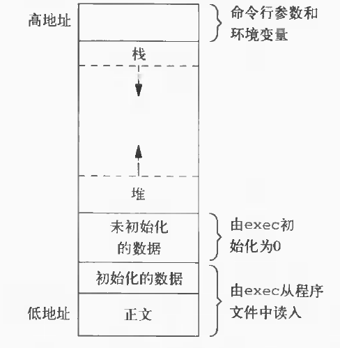

# apue库的安装
1. [参考链接](https://www.cnblogs.com/cherishry/p/6294549.html)
2. [源代码网址](http://www.apuebook.com/code3e.html)
3. 安装流程：
    - 下载源代码
    - 修改代码中对应头文件的位置：apue.3e/threadctl/getenv1.c 和 apue.3e/threadctl/getenv3.c 中头文件 limits.h 的位置
    - 安装所需的包：libbsd 和 libbsd-devel
    - 执行make生成静态库libapue.a
    - 将libapue.a拷贝到链接器的搜索路径，如 /usr/local/lib
    - 将头文件apue.h拷贝到链接器的搜索路径，如 /usr/include 
4. 编译程序时，要使用“-lapue”选项

# 7 进程环境
## 7.1 进程终止
1. 8种方式使进程终止，5种正常终止，3种异常终止
    - 从main返回（正常）
    - 调用exit
    - 调用_exit 或 _Exit
    - 最后一个线程从启动例程返回
    - 从最后一个线程调用pthread_exit
    - 调用abort（异常）
    - 接到一个信号
    - 最后一个线程对取消请求做出响应
2. 退出函数
    - _exit 和 _Exit 立即进入内核
    - exit则先执行一些清理处理（如标准I/O库的清理关闭操作，对所有打开流调用fclose函数），然后返回内核
    - 在main函数中 return(0) 等价于 exit(0)
    - （历史标准）main函数（无论是否声明为整型）终止时没有显示使用return语句或调用exit函数返回0，进程的终止状态时未定义的
    - （C99标准）若main的返回类型是整型（可以不声明，会有警告），且main执行到最后一条语句时返回（隐士返回），则该进程的终止状态为0
```
    #include <stdlib.h>
    void exit(int status);  
    void _Exit(int status);

    #include <unistd.h>
    void _exit(int status);

    //Example hello.c
    #include <stdio.h>
    main()
    {
        printf("hello\n");
    }

    gcc -std=c99 hello.c; ./a.out; echo $? //终止状态是0，且有警告
    gcc hello.c; ./a.out; echo $?    //终止状态不确定，与main函数返回时栈和寄存器的内容相关
```
3. 函数atexit,登记终止处理程序，最后由exit函数自动调用
```
    #include <stdlib.h>
    int atexit(void (*func)(void));
```

## 7.2 C程序的存储空间布局
1. C程序的存储空间分布
    - 正文段：CPU执行的机器指令部分，可共享，只读
    - 初始化数据段：包含了程序中需明确地赋初值的变量
    - 未初始化数据段（bss段）：在程序开始执行之前，内核将此段中的数据初始化为0或空指针；该内容并不存放在磁盘程序文件中
    - 栈：自动变量及每次函数调用时所需保存的信息都存放在此段中
    - 堆：用来动态存储分配
    > 
2. size命令可以查看正文段、数据段和bss段的长度（以字节为单位）

## 7.3 共享库
1. 优点
    - 使可执行文件中不再需要包含公用的库函数，只需在所有进程都可引用的存储区中保存这种库例程的一个副本，减小了可执行文件的长度
    - 库函数版本的更新，无需对使用该库的程序重新连接和编辑（假定参数的数目和类型没改变）
2. 共享库的使用
    - 阻止gcc使用共享库：gcc -static hello.c
    - gcc默认使用共享库：gcc hello.c
    - 使用size命令可以查看可执行文件的正文段、数据段、bss段长度

## 7.4 存储空间分配
1. 空间动态分配函数
```
    #inlcude <stdlib.h>
    void *malloc(size_t size);      //分配的存储区中初始值不确定
    void *calloc(size_t nobj, size_t size);        //分配的存储区空间中的每一位（bit）都初始化为0
    void *realloc(void *ptr, size_t newsize);

    void free(void *ptr);

    上述3个alloc函数都返回都返回通用指针void *，所以若在程序中包括了#include <stdlib.h>（以获得函数原型），
    那么当我们将这些函数返回的指针赋予一个不同类型的指针时，就不需要显示地执行强制类型转换。
    未声明函数的默认返回值为int，所以使用没有正确函数声明的强制类型转换可能会隐藏系统错误，因为int类型的长度
    与函数返回类型值的长度不同。

    这些分配例程通常用sbrk系统调用实现，该系统调用扩充（或缩小）进程的堆。
    虽然sbrk系统调用可以扩充（或缩小）进程的存储空间，但大多数malloc和free的实现都不减小进程的存储空间。释放的
    空间可供以后再分配，但将它们保持再malloc池中而不返回给内核

    大多数实现，所分配的存储空间比所要求的要稍大一些，额外的空间用来记录管理信息--分配块的长度、指向下一个分配块的指针等。
    这意味着如果在超过一个已分配区的尾端或者在已分配区起始位置之前进行写操作，则会改写另一块的管理记录信息。
```

## 7.5 环境表和环境变量
1. 环境表
```
    每个程序都接收到一张环境表，是一个字符指针数组，其中每个指针包含一个以null结束的C字符串的地址。
    全局变量environ包含了该指针数组的地址。

    extern char **environ;      //environ 为环境指针
```
2. 环境变量
    - 环境变量的形式：name=value
    - unix内核并不查看这些字符串，它们的解释完全取决与各个应用程序
    - 通常在一个shell启动文件中设置环境变量以控制shell的动作，如设置了环境变量MAILPATH，则告诉shell去哪里查看邮件
    - 相关函数原型：
    ```
        #include <stdlib.h>
        char *getenv(const char *name);
        int putenv(char *str);      //不为str分配存储空间，不能使用栈中的字符串作为参数
        int setenv(const char *name, const char *value, int rewrite);       //分配存储空间，创建name=value
        int unsetenv(const char *name);

        注意：
            环境表和环境字符串通常占用进程地址空间的顶部，下面是进程的栈空间，因此该空间的长度不能增加。
            所以增加或修改环境字符串时不能使该空间的长度增加。
        
    ```

## 7.6 函数setjmp和longjmp：跨越函数跳转，在栈上跳过若干调用帧
1. C语言中，goto语句不能跨越函数进行跳转
2. setjmp和longjmp组合可以实现跨越函数跳转，这对于处理发生在很深层次的嵌套函数调用中的出错情况非常有用
```
    #include <setjmp.h>
    int setjmp(jmp_buf env);        //直接调用，返回0；若从longjmp返回，返回非0（longjmp的第二个参数值）
    void longjmp(jmp_buf env, int val);

    setjmp将所需的信息记入变量env中，供longjmp函数来恢复当时的环境
```
3. 调用longjmp对自动变量、全局变量、寄存器变量（register）、静态变量和易失变量（volatile）的影响
    - 某个系统的setjmp(3)手册说明，存放在存储器中的变量将具有longjmp时的值，而在CPU和浮点寄存器中的变量则恢复为调用setjmp时的值
    - 全局变量、静态变量和易失变量不受优化的影响，在调用longjmp之后，它们的值是最近所呈现的值
    - 不进行优化时，所有这5个变量都存放在存储器中（即忽略了register存储类说明）
    - 进行了优化后，自动变量和寄存器变量都存放在寄存器中，而volatile变量则仍然存放在存储器中
4. 自动变量的潜在问题
    - 一个函数返回后，它在栈上所使用的空间将由下一个被调用函数的栈帧使用
    - 因此声明自动变量的函数已经返回后，不能再**引用**这些自动变量

## 7.7 函数getrlimit和setrlimit：查询更改进程的资源限制
1. 每个进程都有一组资源限制，进程的资源限制通常是在系统初始化时由0进程建立的
``` 
    #include <sys/resource.h>
    int getrlimit(int resource, struct rlimit *rlptr);
    int setrlimit(int resource, const struct rlimit *rlptr);

    struct rlimit{
        rlim_t rlim_cur;        //soft limit: current limit
        rlim_t rlim_max:        //hard limit: maximum value for rlim_cur
    }
```
2. ISO C 字符串创建运算符（#）
```
    #define doit(name)   pr_limits(#name, name)
    static voiid pr_limits(char *, int);
    
    doit使用了字符串创建运算符，以便为每个资源名产生字符串值；
    doit(RLIMIT_CORE) 将由C预处理程序扩展为 pr_limits("RLIMIT_CORE", RLIMIT_CORE)
```

# 8 进程控制
## 
